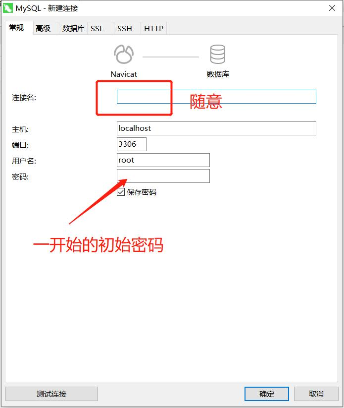

# database_config

## 0 写在前面
- 本系统数据库部分已固定，希望读者按规定创建数据库。
- 如需自定义数据库，请读者更改`code`部分代码，重新定义数据库


## 1 MySQL配置
- MySQL下载
  <details>
  <summary>详情</summary>
  
  进入https://dev.mysql.com/downloads/mysql/，选择合适的操作系统进行下载。  
    
    
  
  将下载的文件解压，比如说解压至D:\mysql-8.0.27，在该文件夹下创建my.ini配置文件。  
  具体内容如下
  ```
  [client]# 设置mysql客户端默认字符集
  default-character-set=utf8
  [mysqld]# 设置3306端口
  port = 3306# 设置mysql的安装目录
  basedir=D:\\mysql-8.0.27
  # 设置 mysql数据库的数据的存放目录，MySQL 8+ 不需要以下配置，系统自己生成即可，否则有可能报错# datadir=C:\\web\\sqldata# 允许最大连接数
  max_connections=20# 服务端使用的字符集默认为8比特编码的latin1字符集
  character-set-server=utf8# 创建新表时将使用的默认存储引擎default-storage-engine=INNODB
  ```
  以`管理员身份`打开 cmd 命令行工具，切换目录：  
    

  初始化数据库  
  `mysqld --initialize --console`  

  会得到MySQL的初始密码：
  ```
  2018-04-20T02:35:05.464644Z 5 [Note] [MY-010454] [Server] 
  A temporary password is generated for root@localhost: APWCY5ws&hjQ
  
  其中APWCY5ws&hjQ  是初始密码
  ```
  输入安装命令  
  `mysqld install`  
  启动输入以下命令  
  `net start mysql` 

  **至此，MySQL配置结束。**
  </details>

- MySQL可视化工具配置
  <details>
  <summary>详情</summary>
  
  选用**Navicat Premium 15**作为可视化工具。  
    

  注册机自行百度解决。  
  连接数据库。（好像还是初始密码，会强制让你改密码啥的）  
    

  修改初始密码。双击2。  
    

  **``将密码修改成 123456``**  

  新建数据库，名称为`cn_sea_data`。  
    

  新建表。    
  `顺序、名称不能出错`。  
  其中，`id 应为 int 型， 自动递增 ，无符号 `。  
  

  数据库配置完，应该是这样。  
  
  
  **至此，MySQL配置结束**。
  </details>

## 附件链接
- [硬件说明](./hw_details.md)。
- [数据库配置](./db_config.md)。
- [系统测试](./system_test.md)。
- [系统常见问题](./Q&A.md)。


