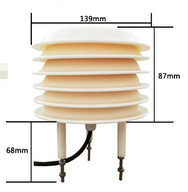
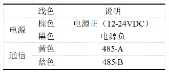
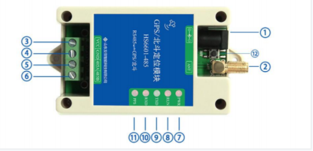

# hardware_details

## 0 写在前面
- 具体硬件
  - [气象百叶窗](./books/JXBS-3001-BYX.doc)
  - [北斗定位装置](./books/HS6601.pdf)
- 关于硬件，这边只做简单介绍

## 1 接口说明
- **气象百叶窗**
  

  
详情
  
        
    **气象百叶窗实物如下**  
     
      

    **note：**
  - 电源接口为宽电压电源输入 12-24V 均可。485 信号线接线时注意 A/B 两条线不能接反，总线上多台设备间地址不能冲突
  - 出厂默认提供0.6米长线材 ，客户可根据需要按需延长线材或者顺次接线。
  

- **北斗定位装置**
  

  
详情
  
        
    **北斗接口定义**

    |编号|端子定义|说明|
    |:---:|:---:|:---:|
    |1|电源适配器接口|输入 5~28V 直流电源|
    |2|天线|SMA 天线接口|
    |3|VCC|输出电源正极，与电源适配器接口联通|
    |4|GND|输出电源负极|
    |5|485 A|RS485 总线的A|
    |6|485 B|RS485 总线的B|
    |7|PWR 指示灯|电源指示灯，上电常亮|
    |8|RUN 指示灯|运行指示灯，正常运行时亮 1 秒，灭 1 秒|
    |9|TXD 指示灯|发送指示灯，向 RS485/RS232 总线接发送数据时闪烁|
    |10|RXD 指示灯|接收指示灯，从 RS485/RS232 总线接收到数据时闪烁|
    |11|PPS|秒脉冲指示灯	定位无效时常亮；定位有效后，每秒闪烁一次|
    |12|按键|长按 5 秒，开始恢复出厂设置，同时 RUN 运行指示灯快闪，完成后，运行指示灯正常闪烁。出厂设置为：地址为 1，串口通信 9600/8/One/None。|
    
    **北斗实物图**  
     
  

## 2 安装说明
- 安装位置需要注意以下事项
  

  
详情

  - 变送器应尽量水平安防，保证安装垂直于水平面。
  - 安装高度为人体坐高或主要要求测量的环境区域。
  

  
- 同时请注意以下防范事项
  

  
详情
  
  
  - 避免在易于传热且会直接造成与待测区域产生温差的地带安装，否则会造成温湿度测量不准确。
  - 安装在环境稳定的区域,避免直接光照,远离窗口及空调、暖气等设备,避免直对窗口、房门。
  - 尽量远离大功率干扰设备，以免造成测量的不准确,如变频器、电机等。
  

## 附件连接
- [硬件说明](./hw_details.md)。
- [数据库配置](./db_config.md)。
- [系统测试](./system_test.md)。
- [系统常见问题](./Q&A.md)。

