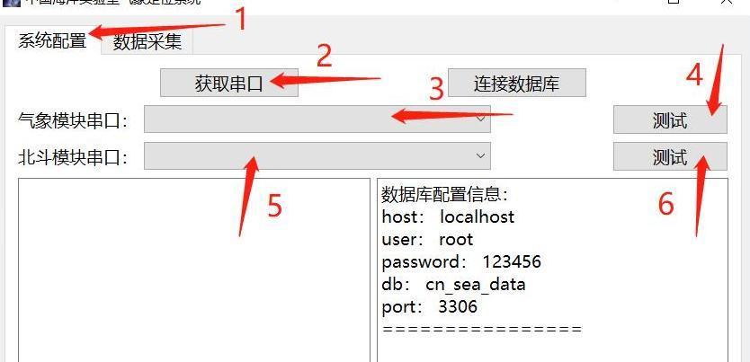
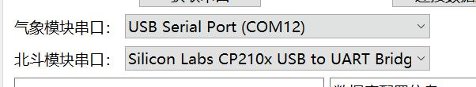
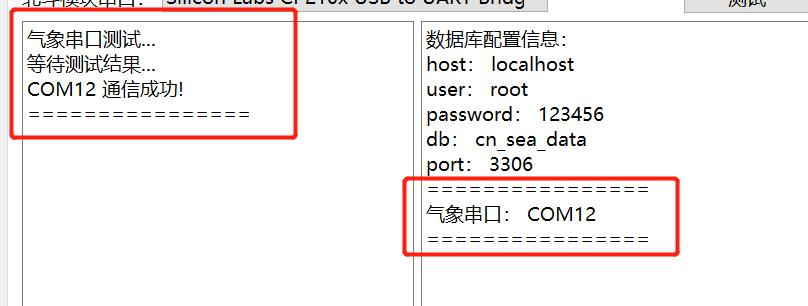
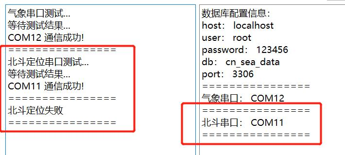
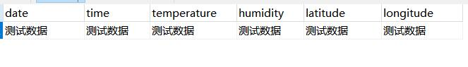
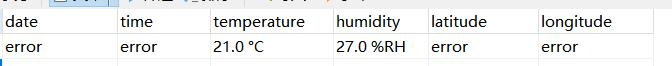
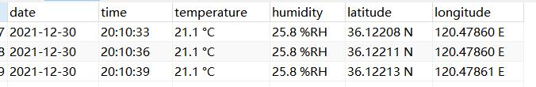

# system_test

## 0 code介绍
- main.py  
  主要负责ui界面的生成与相关功能初始化。
- handle.py  
  主要负责端口测试与数据库连接测试。
- work.py  
  主要负责端口数据的解析与写入数据库。
- global_var.py  
  存放系统设计时的全局变量。

## 1 软件介绍
- 界面展示
  

  
详情

  
  运行程序在中国海洋实验室气象定位系统文件下的中国海洋实验室气象定位系统.exe  
  该应用程序分为两个页面，系统配置和数据采集。  

  首先应在系统配置界面进行串口与数据库的测试。  
    

  在数据采集页面，程序可以自由设置采样频率（默认3秒/次），实时显示结果。  
  
  

- 串口测试
  

  
详情

  大体测试流程如下  
    
  1.选择系统配置  
  2.点击获取串口  
  3.根据模块选择合适串口号（串口设备过多时，`建议去设备管理器通过拔插外设进行串口确认`）  
    
  4.点击测试（测试通过则会固化串口号，测试按键失效）  
    
  5.选择北斗模块串口  
  6.点击测试（北斗模块的测试分成两部分，一部分是端口的正确与否，另一部分是北斗模块是否准确定位）（`定位问题：室内定位经常失败，建议将天线放在室外`）  
    
  **至此，串口测试结束。**
  

- 数据库测试
  

  
详情

  点击连接数据库。系统会连接数据库，并向数据库中写入测试数据。  
  **note:** `数据库测试之前需正确配置硬件端口`  
    
  前往数据库中查看。   
    
  **如上所示，则数据库测试成功。**
  

- 数据采集
  

  
详情

  点击数据采集。自行设置采样频率（`默认是3秒/次`）。读者修改完采样频率后，`一定要按下回车方可生效`。  
  
  
  点击开始采集。在系统配置界面则会显示你的配置信息，包括数据库信息、对应端口、采样频率。系统配置界面的所有按钮显示为不可操作状态。
  想结束采集时，可以点击结束采集按钮，也可以直接关闭程序。  
  北斗没有成功定位时，采集的数据为：  
  

  北斗成功定位时，采集的数据为：  
  
  
  **至此，系统测试成功。**
  

## 附件连接
- [硬件说明](./hw_details.md)。
- [数据库配置](./db_config.md)。
- [系统测试](./system_test.md)。
- [系统常见问题](./Q&A.md)。

